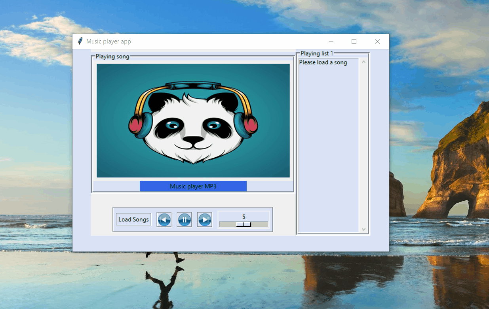

# Media_player_app
A simple media player desktop-based app implemented by Tkinter(GUI) and Pygame(backend). The app have simple functional:
+ Move to next, previous song
+ Increase, decrease volumn
+ Pause, unpause playing song
+ Load songs from folder in computer

To run the code
```
python music_player.py
```

Installed library
+ python 3.6.12
+ pygame 2.0.1

Demo app

